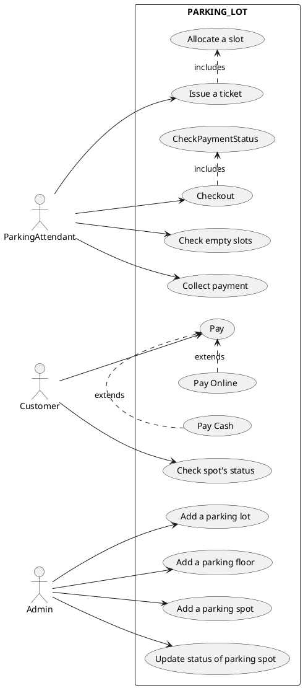
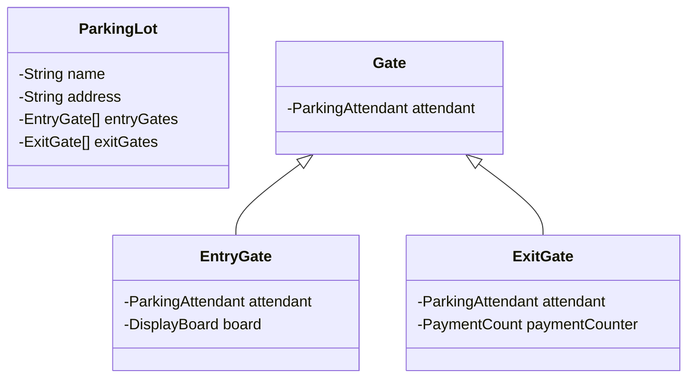
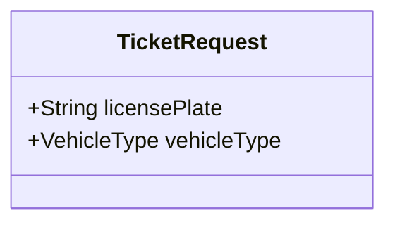
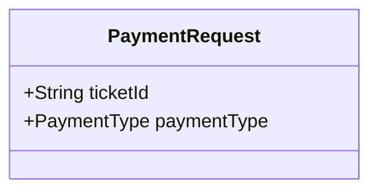
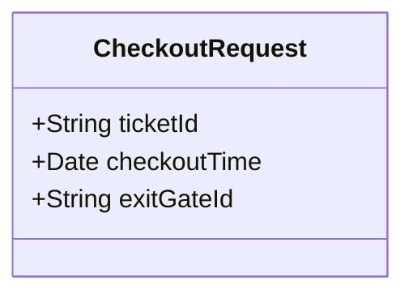

# PARKING LOT

> A parking lot or car park is a dedicated cleared area that is intended for parking vehicles. In most countries where cars are a major mode of transportation, parking lots are a feature of every city and suburban area. Shopping malls, sports stadiums, megachurches, and similar venues often feature parking lots over large areas
[Reference](https://github.com/tssovi/grokking-the-object-oriented-design-interview/blob/master/object-oriented-design-case-studies/design-a-parking-lot.md)

> Parking lot is an open area designated for parking cars. We will design a parking lot where a certain number of cars can be parked for a certain amount of time. The parking lot can have multiple floors where each floor carries multiple slots. Each slot can have a single vehicle parked in it.
[Reference](https://medium.com/double-pointer/system-design-interview-parking-lot-system-ff2c58167651)

## QUESTIONS
- can it have multiple floors ?
    - `N floors`

- Each floor have multiple slots
- Slots
    - Large
    - medium
    - small
- A vehicle can only park in its own type slot
- Multiple entry gates & exit gates
- Each entry gate will have a display board
- How to enter ?
    - Operator will give you a ticket
- How do we pay ?
    - calculation
        - cost(type, duration)
    - Modes
        - cash, cards, UPI/Online
    - Payment counter
        - At every floor
- Display Board
    - Empty slots
- Allocation
    - any random empty slot
    - future might want to make this optimal

## REQUIREMENTS
Build an online parking lot management system that can support the following requirements:
* Should have multiple floors.
* Multiple entries and exit points.
* A person has to collect a ticket at entry and pay at or before exit.
* Pay at:
    * Exit counter (Cash to the parking attendant)
    * Dedicated automated booth on each floor
    * Online
* Pay via:
    * Cash
    * Credit Card
    * UPI
* Allow entry for a vehicle if a slot is available for it. Show on the display at entry if a slot is not available.
* Parking Spots of 3 types:
    * Large
    * Medium
    * Small
* A car can only be parked at its slot. Not on any other (even larger).
* A display on each floor with the status of that floor.
* Fees calculated based on per hour price: e.g. 50 rs for the first hour, then 80 rs per extra hour.
  * Small - 50, 80
  * Medium - 80, 100
  * Large - 100, 120

## VISUALIZATION

 

## ACTORS
1. Customer
2. Parking Attendant
3. Admin

### Admin
 
Use cases: 
1. Create a parking lot
2. Create a parking floor
3. Add new parking spots
4. Update status of a parking lot

### Parking Attendant
Use Cases:
1. Check empty slots
2. Issue a ticket
3. Collect payment
4. Checkout

### Customer
Use Cases:
1. Pay
2. Check status

## USE CASE DIAGRAM

## MAJOR CLASSES & ATTRIBUTES

* Parking Lot
    * Name
    * Address
    * Floors
    * Entry Gates
    * Exits Gates
    * Display Board

* Floor
    * Floor number
    * Parking Spots
    * Display Board
    * Payment counter

* Parking Spot
    * Spot status - `Occupied, Available, Out of order`
    * Spot number
    * type - `SMALL, MEDIUM, LARGE`

* Ticket
    * start time
    * Vehicle
    * Parking Spot
    * Entry Gate
    * Parking Attendant

* Invoice
    * Exit Time
    * Amount
    * Ticket
    * Payment

* Payment
    * Invoice
    * Mode - `Cash, credit, UPI`
    * Amount
    * Status - `Pending, Done, Failed`
    * Time

* Vehicle
    * Type
    * Number

* Display Board
* Payment Counter
* Entry Gate
    * Parking Attendant
    * Display Board
* Exit Gate
    * Payment Counter
    * Parking Attendant

### Cardinalities
1. Parking Lot -> Parking Floor - 1:M
2. Parking lot -> Parking Gate - 1:M
3. Invoice -> Payment - 1:1
4. Parking Ticket -> Vehicle - M:1
 tickets for each entry reusing the stored vehicle

## CLASS DIAGRAM

## API design

What will be some APIs that you would design for this system?

Look at the use cases and try to design APIs for each of them.

You can simply write the APIs in the following format:
`API name` - `HTTP method` - `URL` - `?Request body` - `?Response body`

You could also use a tool like [Swagger](https://swagger.io/) to design the APIs or follow [this](https://github.com/jamescooke/restapidocs) repository for a simple way to use Markdown to structure your API documentation.

### Admin APIs

All the various use cases are simple CRUD operations. We can design the following APIs for the admin:

#### Parking lot APIs
* `createParkingLot` - `POST /parking-lot` - Request body: `ParkingLot`
* `getParkingLot` - `GET /parking-lot/{id}` - Response body: `ParkingLot`
* `getAllParkingLots` - `GET /parking-lot` - Response body: `List<ParkingLot>`
* `updateParkingLot` - `PUT /parking-lot/{id}` - Request body: `ParkingLot`
* `deleteParkingLot` - `DELETE /parking-lot/{id}`

Similarly, we can design APIs for `ParkingFloor`, `ParkingSpot`.

#### Parking spot APIs
* `createParkingSpot` - `POST /parking-spot` - Request body: `ParkingSpot`
* `getParkingSpot` - `GET /parking-spot/{id}` - Response body: `ParkingSpot`
* `getAllParkingSpots` - `GET /parking-spot` - Response body: `List<ParkingSpot>`
* `updateParkingSpot` - `PUT /parking-spot/{id}` - Request body: `ParkingSpot`
* `deleteParkingSpot` - `DELETE /parking-spot/{id}`

You might also want an API to `Update status of a parking spot`. This can be done by using the existing `updateParkingSpot` API or by creating a new API that only updates the status of the parking spot.

* `updateParkingSpotStatus` - `PUT /parking-spot/{id}/status` - Request body: `ParkingSpotStatus`
* `getParkingSpotStatus` - `GET /parking-spot/{id}/status` - Response body: `ParkingSpotStatus`

### Parking attendant APIs

Use cases:
1. `Check empty slots`
2. `Issue a ticket` - `Allocating a slot`
3. `Collect payment`
4. `Checkout` - `Has the user paid?`

#### Check empty slots

Let us look at the various requirements for a parking spot:
* CRUD on parking spots
* Get all parking spots
* Get all available parking spots

We can augment our current `getAllParkingSpots` API by adding a query parameter to filter the parking spots based on their status. This will allow us to get all the available parking spots as well.

**Get all parking spots**
* `getAllParkingSpots` - `GET /parking-spot` - Response body: `List<ParkingSpot>`

**Get all available parking spots**
* `getAllParkingSpots` - `GET /parking-spot?status=AVAILABLE` - Response body: `List<ParkingSpot>`

**Get all occupied parking spots**
* `getAllParkingSpots` - `GET /parking-spot?status=OCCUPIED` - Response body: `List<ParkingSpot>`

#### Issue a ticket

* `issueTicket` - `POST /ticket` - Request body: `TicketRequest` - Response body: `Ticket`

We might not want to use the current `Ticket` class for the request body since it contains a lot of information that is either not required or is not available at the time of ticket generation. We can create a new class `TicketRequest` that contains only the required information.

### Collect payment

* `collectPayment` - `POST /payment` - Request body: `PaymentRequest` - Response body: `Payment`

PaymentRequest:

### Checkout

* `checkout` - `POST /checkout` - Request body: `CheckoutRequest` - Response body: `CheckoutResponse`

CheckoutRequest:

