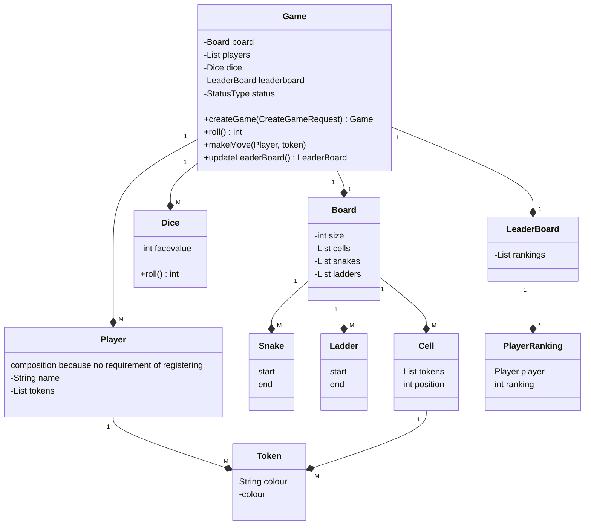
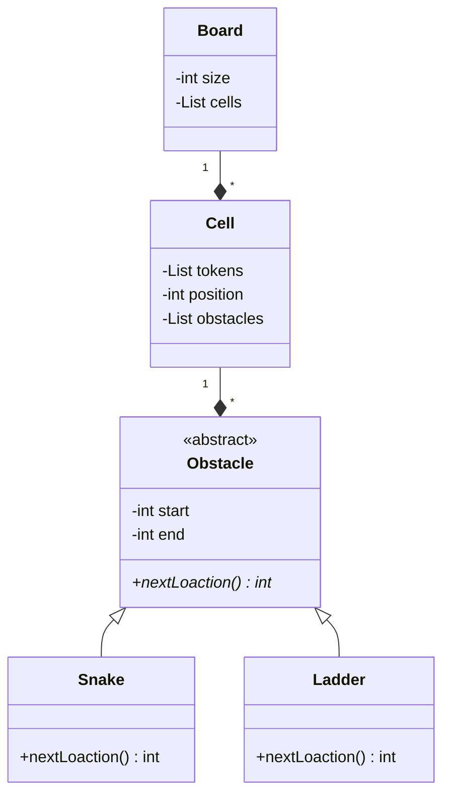

# SNAKES AND LADDERS

## QUESTIONS - Current scope
- Board Size `1-> N`
- Multiple Players `> 2`
- `Only` Human Player
- Start Game Dice `1 Or 6/Maximum`
- Snakes & Ladders
    - User inputs the number of snakes and ladders
    - OR Random
    - OR eq number
- A player wins by reaching the last cell
- A player can have multiple tokens
- 1st - All tokens of a single player reaches the last
- If N-1 players wins then `Game Ends`
- Leaderboard

## ACTUAL REQUIREMENT
- A game can be between multiple players.
- A game will only have human players
- Each player can have multiple pieces
- A board can be of any varying size decided by the client
- A board will have different types of cells
- There can be a normal cell and cells with snakes and ladders
- Position of snakes and ladders is random and decided at the start of the game
- The number of snakes and ladders is random and also decided at the start of the game
- The size of snakes and ladders is also random and decided at the start of the game
- A player will move on the basis of a dice
- A player will enter the game only if they get a 1 or maximum face value of the dice
- A player will win if they reach the last cell
- The game will end when all players expect one reach the last cell
- For each game maintain a leaderboard which has the rankings of each player

## ENTITES

- Game
    - Board
        - Cells
        - Snake
        - Ladder
        - Tokens
    - DICE
    - Players
    - LeaderBoard

## Initial Design

## Problems with Initial Design
- OCP violation in Board, if have to add new type of snake ladder kind of think like frog etc.
- No parent class for specials cells

## Solutions

### Adding a new parent class for snake and ladder

- Problem here is we have to add null checks because cell might have obstacle or not
`But these can be fixed by null checks`
