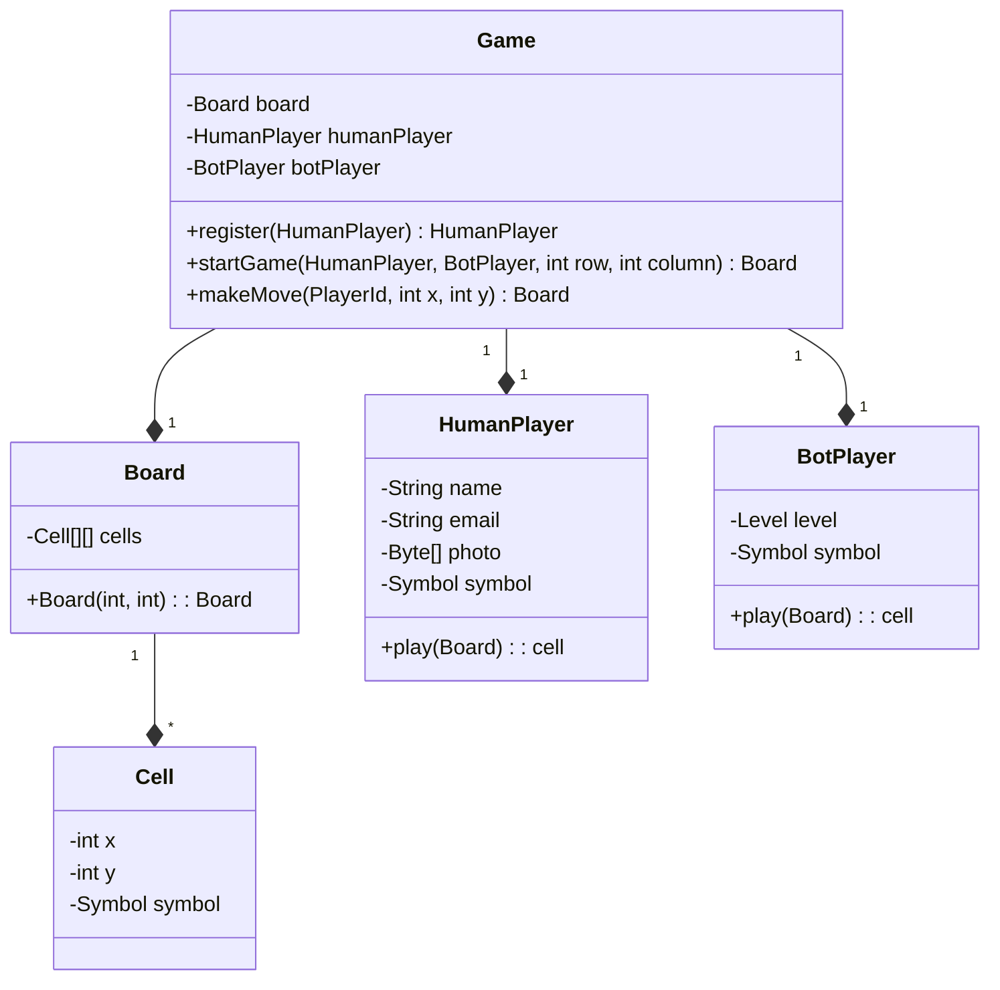
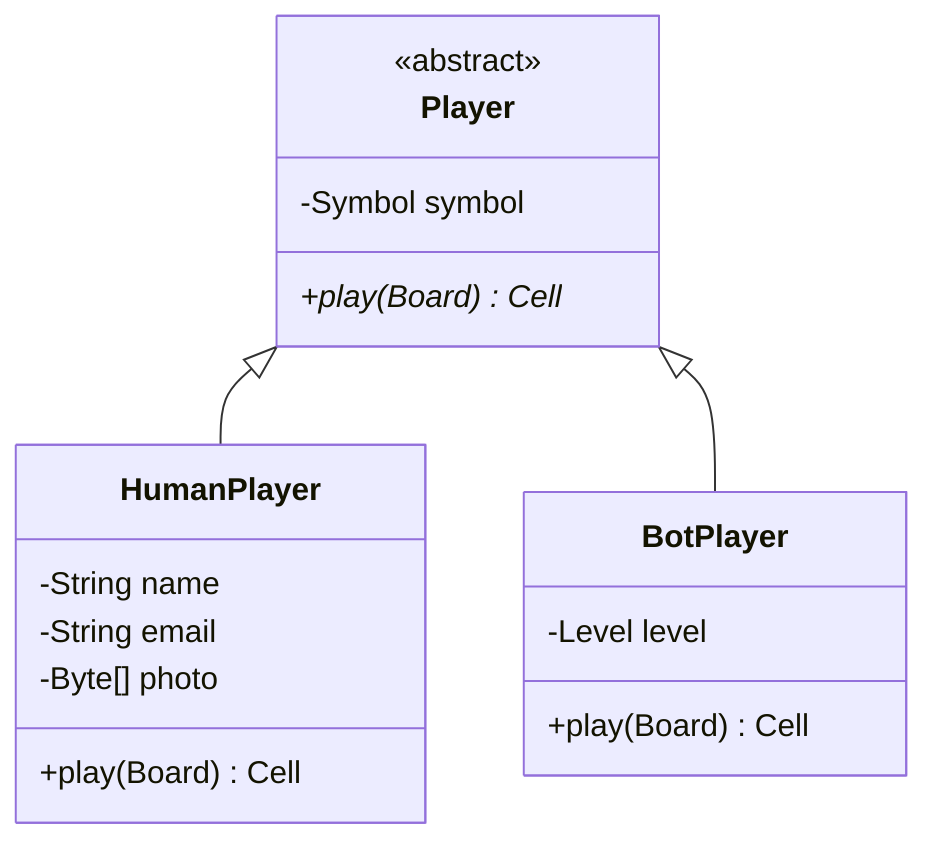
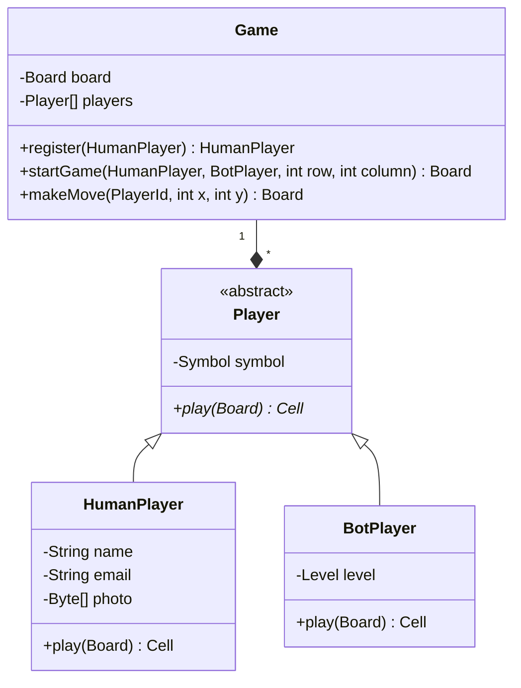
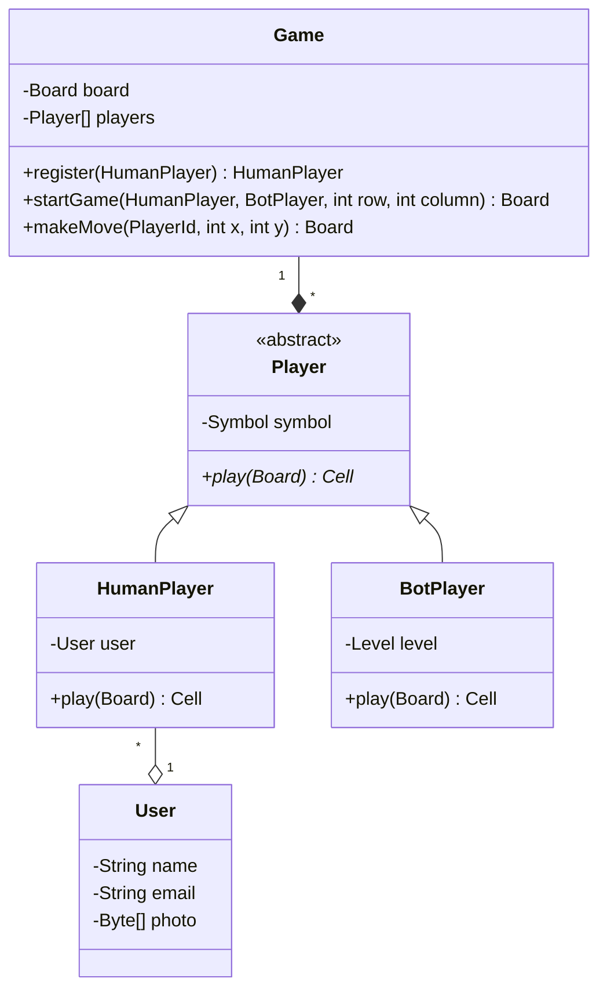
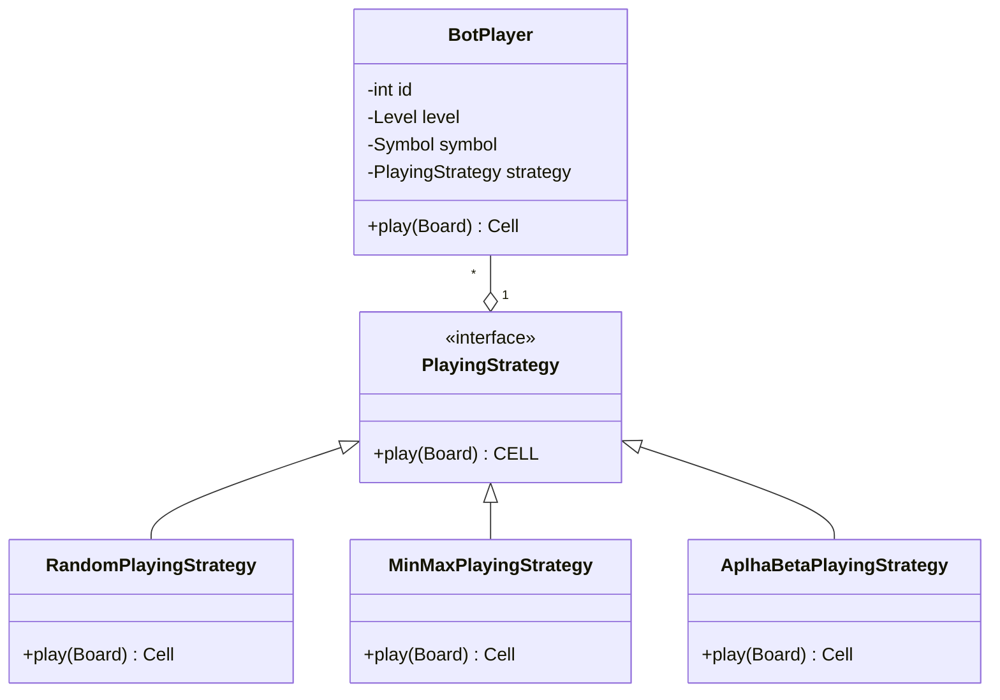
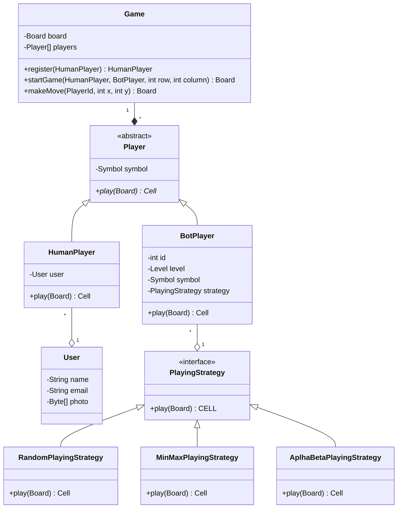

### Tic Tac Toe

## v1: Initial Design


Problems
* There is no common contract (generic player) for Human and Bot Player to be used in methods such as make move.
* Human Player cannot play with human player. There is tight coupling between Game and different types of players. It is not extinsible to support multiple players.
* OCP & SRP violations in play() method based on the difficulty level.
* Huge memory consumption- multiple instances of the player will be created for multiple games. Each instances has a new photo.

## Solutions

### <b>Common contract - `Player parent class`</b>
- common beahviour - `play()`
- common attr - `symbol`


### Now

* ~~There is no common contract (generic player) for Human and Bot Player to be used in methods such as make move.~~
* Human Player cannot play with human player. There is tight coupling between Game and different types of players. It is not extinsible to support multiple players.
* OCP & SRP violations in play() method based on the difficulty level.
* Huge memory consumption- multiple instances of the player will be created for multiple games. Each instances has a new photo.

### <b>Tight coupling</b>
- HumanPlayer
- BotPlayer
- Player[] players



### Now

* ~~There is no common contract (generic player) for Human and Bot Player to be used in methods such as make move.~~
* ~~Human Player cannot play with human player. There is tight coupling between Game and different types of players. It is not extinsible to support multiple players.~~
* OCP & SRP violations in play() method based on the difficulty level.
* Huge memory consumption- multiple instances of the player will be created for multiple games. Each instances has a new photo.


### <b>Huge memory consumption - `Flyweight Pattern`</b>
Suppose there is a player -Paul Morphy playing two games at a time.
Therefore 
- instance 1
    - name : Paul
    - email : paul@abc.in
    - photo : 5MB
    - symbol : O

- instance 2
    - name : Paul
    - email : paul@abc.in
    - photo : 5MB
    - symbol : X

- we can see photo, name, email doesn't change but symbol can
- store fields that do not change in a class - `intrinsic state`
- store fields that do change in a class - `extrinsic state`



### Now

* ~~There is no common contract (generic player) for Human and Bot Player to be used in methods such as make move.~~
* ~~Human Player cannot play with human player. There is tight coupling between Game and different types of players. It is not extinsible to support multiple players.~~
* OCP & SRP violations in play() method based on the difficulty level.
* ~~Huge memory consumption- multiple instances of the player will be created for multiple games. Each instances has a new photo.~~

### <b>OCP and SRP violation in play method - `Strategy Pattern`</b>

## implement different levels in Bot Player

```java

class BotPlayer extends Player{

    private Level level:

    private Cell play(Board board){
        switch (level){
            case EASY:
            case MEDIUM:
        }
    }
}

```
* but this violates SRP and OCP because in future there might be different levels coming up
* Therefore we need to inject different behaviours such that they can we reused, we use always
    * Strategy Design pattern


### Now

* ~~There is no common contract (generic player) for Human and Bot Player to be used in methods such as make move.~~
* ~~Human Player cannot play with human player. There is tight coupling between Game and different types of players. It is not extinsible to support multiple players.~~
* ~~OCP & SRP violations in play() method based on the difficulty level.~~
* ~~Huge memory consumption- multiple instances of the player will be created for multiple games. Each instances has a new photo.~~


## v2 Improved design after v1




